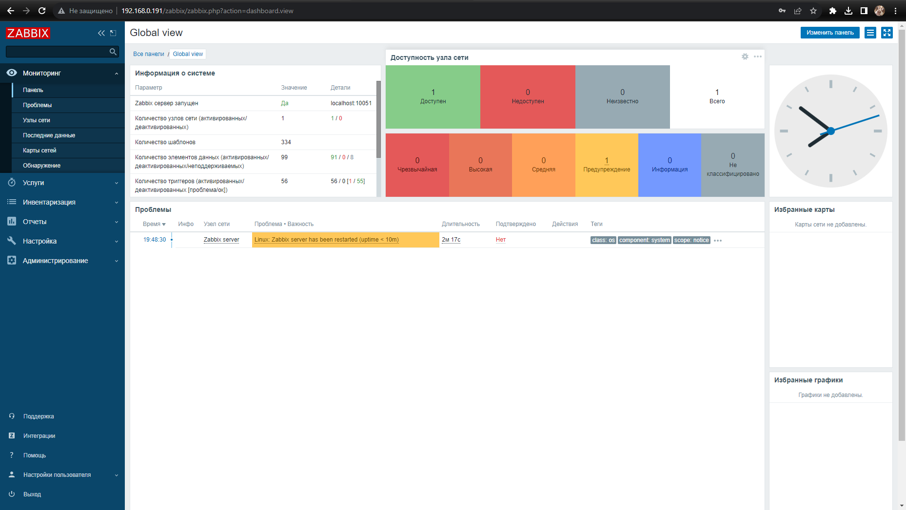
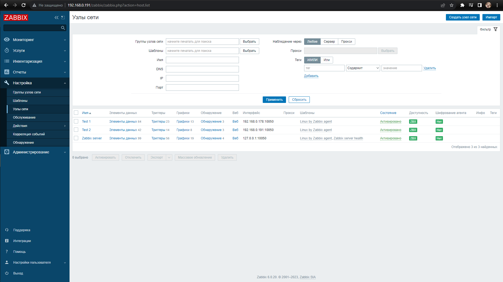
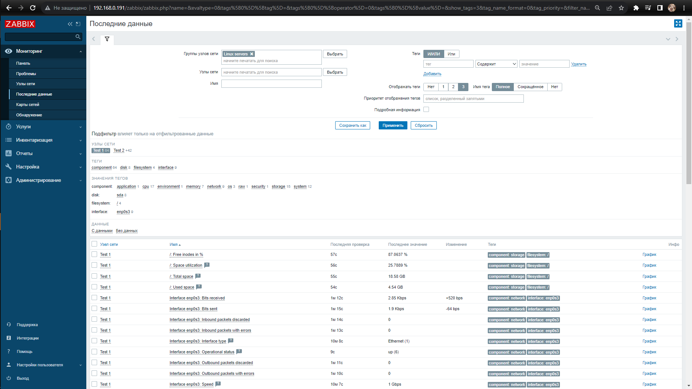
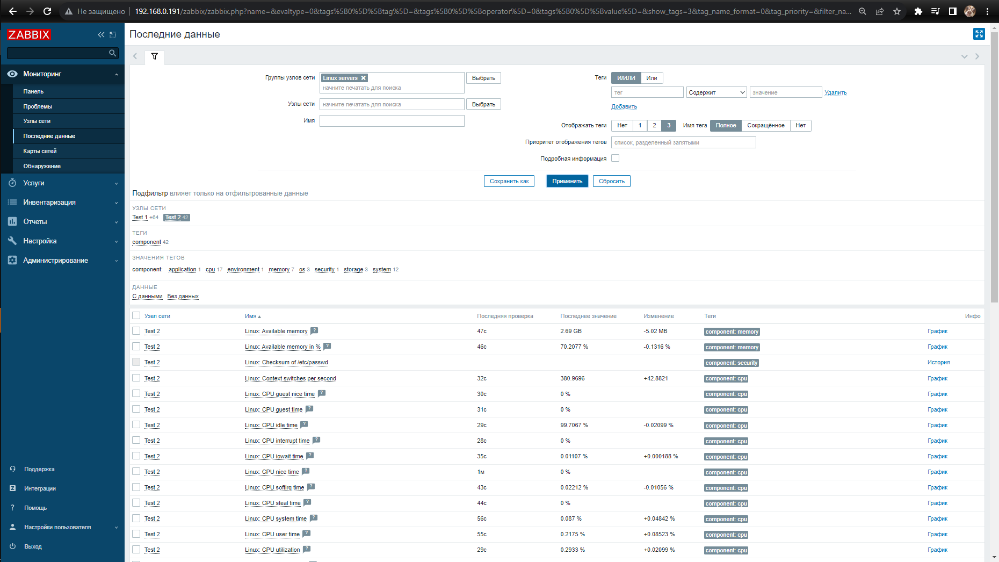

# Домашнее задание к занятию 9.2 «Zabbix. Часть 1»

### Задание 1 

Установите Zabbix Server с веб-интерфейсом.

*Приложите скриншот авторизации в админке.*
*Приложите текст использованных команд в GitHub.*

1. Устанавливаю Postgresql:
```bash
sudo apt update
```
```bash
sudo apt -y install postgresql
```
2. Устанавливаю репозиторий Zabbix:
```bash
wget https://repo.zabbix.com/zabbix/6.0/debian/pool/main/z/zabbix-release/zabbix-release_6.0-4+debian11_all.deb
```
```bash
dpkg -i zabbix-release_6.0-4+debian11_all.deb
```
```bash
apt update
```
3. Устанавливаю Zabbix сервер, веб-интерфейс и агент:
```bash
apt install zabbix-server-pgsql zabbix-frontend-php php7.4-pgsql zabbix-apache-conf zabbix-sql-scripts zabbix-agent
```
4. Создаю пользователя и БД:
```bash
sudo -u postgres createuser --pwprompt zabbix
```
```bash
sudo -u postgres createdb -O zabbix zabbix
```
5. Импортирую начальную схему и данные:
```bash
zcat /usr/share/zabbix-sql-scripts/postgresql/server.sql.gz | sudo -u zabbix psql zabbix
```
6. Редактирую файл файл /etc/zabbix/zabbix_server.conf :
```
DBPassword=password
```
7. Запускаю процессы Zabbix сервера и агента и настраиваю их запуск при загрузке ОС:
```bash
systemctl restart zabbix-server zabbix-agent apache2
```
```bash
systemctl enable zabbix-server zabbix-agent apache2
```

---

### Задание 2 

Установите Zabbix Agent на два хоста.

*Приложите скриншот раздела Configuration > Hosts, где видно, что агенты подключены к серверу.*
*Приложите скриншот лога zabbix agent, где видно, что он работает с сервером.*
*Приложите скриншот раздела Monitoring > Latest data для обоих хостов, где видны поступающие от агентов данные.*
*Приложите текст использованных команд в GitHub.*
1. Устанавливаю репозиторий Zabbix на оба хоста:
```bash
wget https://repo.zabbix.com/zabbix/6.0/debian/pool/main/z/zabbix-release/zabbix-release_6.0-4+debian11_all.deb
```
```bash
dpkg -i zabbix-release_6.0-4+debian11_all.deb
```
```bash
apt update
```
2. Устанавливаю Zabbix-agent на оба хоста:
```bash
apt install zabbix-agent
```
3. Добавляю адрес zabbix-server в zabbix_agent2.conf на обоих хостах:
```bash
sudo nano /etc/zabbix/zabbix_agent.conf
```
4. Рестарт и автозапуск Zabbix-agent на обоих хостах:
```bash
systemctl restart zabbix-agent
```
```bash
systemctl enable zabbix-agent
```



